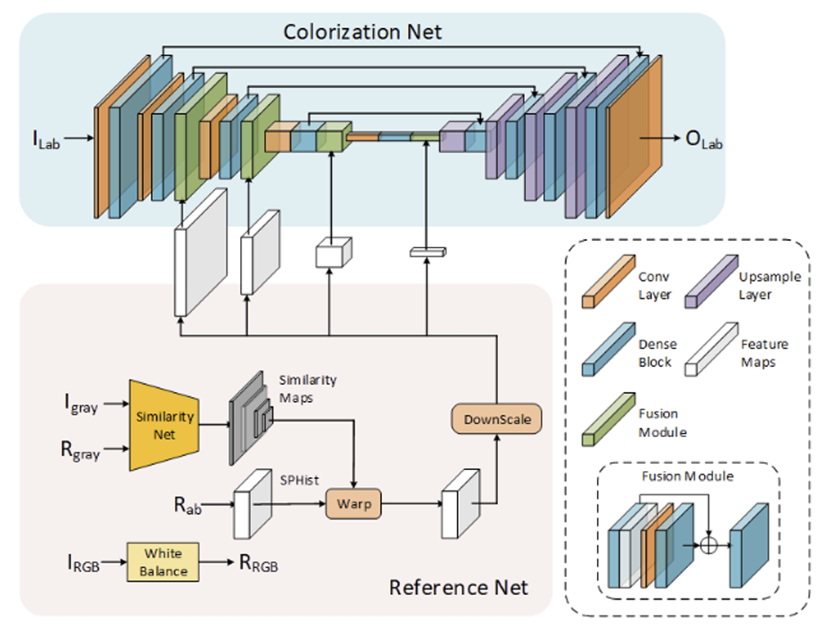
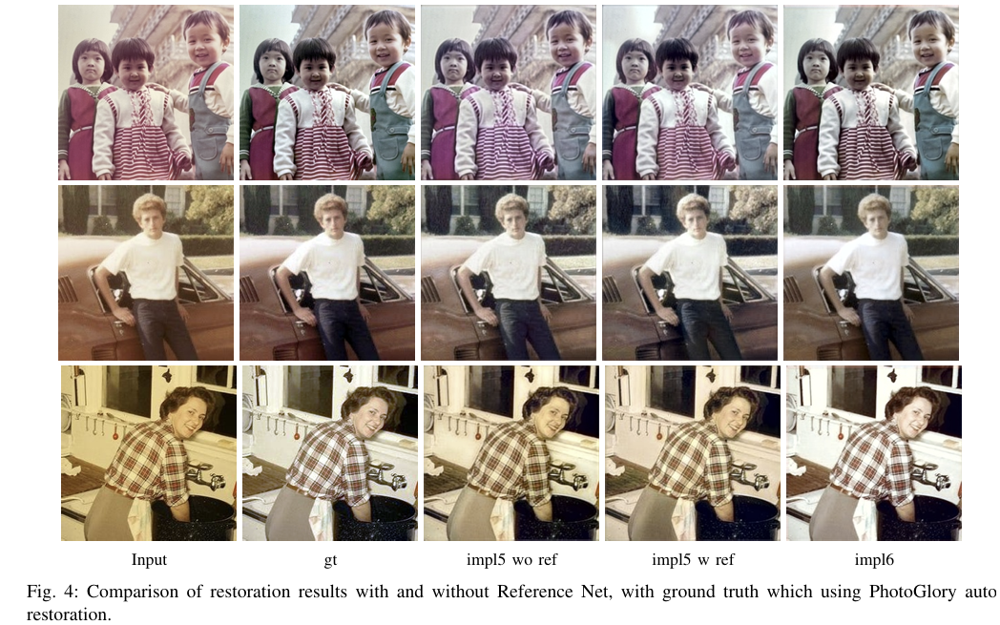

# Automatic Color Cast Restoration for Aged Photographs via Residual SE-U-Net in CIELab Space

Old photographs frequently experience significant color shifts, such as pronounced yellow or red tints, as a result of temporal degradation and improper storage. While traditional digital photo restoration methods heavily depend on manual, labor-intensive editing in software like Adobe Photoshop, existing deep learning research predominantly targets the colorization of black-and-white images rather than correcting color casts in already colored photographs. To address this technical gap, this project introduces an end-to-end deep learning framework designed to automatically correct color degradation and restore authentic color balance to vintage images.

By mapping the restoration process into the CIELab color space, the engine decouples image luminance from chromatic channels ($a$ and $b$), effectively resolving the unnatural color shifts and blue-cast artifacts that plague naive RGB-based approaches. The network architecture utilizes a streamlined Residual U-Net structure enhanced with Squeeze-and-Excitation (SE) blocks to focus on local restoration cues while mitigating feature propagation redundancy. This implementation represents the peak performance framework developed during our research initiative at National Tsing Hua University (NTHU EE).

---

## 1. Key Technical Highlights

* **Luminance-Chroma Decoupling (CIELab Space):** Transforms standard RGB inputs into the CIELab domain, separating the brightness channel ($L$) from the color channels ($a, b$) to prevent structural luminance alteration during color cast correction.
* **Feature Propagation Optimization:** Replaces conventional Dense Blocks with a lightweight Residual U-Net and SE-Block hybrid architecture, preventing overtransmission of irrelevant global features and minimizing overfitting risks on limited datasets.
* **Multi-Objective Composite Loss Evaluation:** Employs a differentiable joint loss function incorporating Pixel-wise $L_1$ Loss, Structural Similarity Index (**SSIM**) Loss, Earth Mover's Distance (**EMD**) Histogram Loss, and high-level **VGG Perceptual Features** to balance global color distribution and pixel-level spatial accuracy.
* **Automated MLOps Execution Pipeline:** Includes production-ready execution wrappers (`train.sh`, `test.sh`) for rapid deployment and automated batch inference on Linux-based high-performance computing clusters.

## 2. Core Technical Philosophy: Style Mimicking & Patch-Based Learning

A critical engineering bottleneck in real-world historical image restoration is the lack of authentic ground truth references; faded or damaged vintage photographs do not possess pre-existing pristine twins. To overcome this challenge without falling back on rigid, hand-crafted color-correction heuristics, this framework introduces a **Data-Driven Style Mimicking Paradigm**.

### A. Few-Shot Expert Style Transfer (Proof of Concept)
Rather than manually reverse-engineering complex Adobe Photoshop curve adjustments, lookup tables (LUTs), or rule-based color balancing algorithms, our architecture treats image restoration as an example-based mapping problem. 
* **The Supervision Protocol:** For this implementation, the pipeline utilizes a selective golden dataset of 27 high-quality paired historical samples supervised by deterministic `PhotoGlory` algorithmic outputs to serve as a clean proof of concept. 
* **The Mimicking Framework:** The system successfully validates that a deep convolution network can learn to capture and replicate highly intricate color cast transformations with exceptional fidelity from a minimal sample set. 
* **Industrial Scalability:** If a professional photo restoration master manually retouches a minimal golden set of 20 to 30 images, this engine can encode that master's unique artistic sensibilities and color profile into the network weights. The trained model can then act as an automated deployment pipeline, mass-producing identical high-end restoration styles across thousands of archived assets.

### B. Patch-Based Localized Augmentation Strategy
Training highly parameter-dense deep neural networks on small datasets typically invites catastrophic overfitting. To secure robust training stability from the 27 baseline pairs, we implemented a **Patch-Based Cropping Strategy**:
* **Dimension Manipulation:** The 27 high-resolution uncompressed photo pairs were spatially decomposed and center-cropped into  distinct, localized sub-tensors of $256 \times 256$ pixels.
* **Algorithmic Justification:** By shifting the structural focus from macroscopic semantic images down to localized patches, the network is discouraged from memorizing large-scale semantic contexts (e.g., identifying specific faces or objects). Instead, it is forced to specialize in generalized pixel-wise chromatic variations, color distribution alignments, and localized frequency boundaries. This patch-based constraint ensures excellent generalization capabilities during inference on unseen historical photos.

---
## 3. System Architecture & Multi-Objective Loss Formulation

The architecture organizes feature extraction and color distribution mapping using a decoupled color-space strategy. Instead of calculating backward gradients directly on entangled RGB channels, the network ingests structural tensors within the CIELab domain and balances optimization tasks across distinct architectural sub-modules.

### A. Network Topology & Feature Flow Control
In earlier development iterations, conventional Dense Block-based connectivity was utilized. However, dense reuse loops tend to propagate excessive feature information across layers, creating unnecessary complexity and feature redundancy that triggers overfitting on sparse historical inputs. 

To overcome this, the final pipeline deploys a 5-layer **Residual U-Net** structure amplified by **Squeeze-and-Excitation (SE) Blocks**:
* **Residual Connections:** Protect stable gradient flow while enabling deep spatial encoding.
* **SE Attention Blocks:** Re-calibrate channel-wise feature responses by explicitly modeling interdependencies between channels, thereby restricting forward feature propagation to what is strictly essential for local chromatic restoration.
* **Decoupled Processing:** The pipeline completely bypasses physical degradation tracking (omitting the legacy Pik-fix Restoration Net entirely) to dedicate 100% of network capacity toward the Core Colorization module.



### B. Joint Composite Loss Formulation

To ensure strict pixel-level alignment while concurrently matching the complex global color distribution of pristine target images, the network is driven by a custom, differentiable joint multi-loss objective function. Backpropagation gradients are calculated across four weighted sub-metrics to balance structural preservation against chromatic restoration accuracy:

$$\mathcal{L}_{total} = \mathcal{L}_{rec, lab} + 0.5 \cdot \mathcal{L}_{SSIM} + 0.2 \cdot \mathcal{L}_{EMD, h} + 0.1 \cdot \mathcal{L}_{perceptual}$$

---

#### 1. Pixel-Wise Absolute Reconstruction Loss ($\mathcal{L}_{rec, lab}$)
The foundation of the optimization pipeline relies on an $L_1$ penalty calculated directly within the CIELab color space. This loss calculates the pixel-wise absolute differences across all three decoupled channels, including luminance ($L$) and chromaticity ($a, b$):

$$\mathcal{L}_{rec,lab} = \|I_{lab} - G_{lab}\|_1$$

Where $I_{lab}$ represents the predicted output tensor and $G_{lab}$ represents the ground truth reference. By minimizing the absolute error per pixel, the model is forced to reconstruct structural details with high spatial fidelity. Compared to standard $L_2$ (MSE) functions, the $L_1$ loss reduces sensitivity to anomalous outliers, suppressing blurriness and securing robust convergence on noisy historical photo grains.

---

#### 2. Structural Similarity Index Loss ($\mathcal{L}_{SSIM}$)
While pixel-by-pixel metrics stabilize basic boundaries, they often fail to capture human perceptual structures. To evaluate localized image quality based on human visual assessment, an index measures structural similarity across contrast, luminance, and structural covariance boundaries:

$$\mathcal{L}_{SSIM} = 1 - \textbf{SSIM}(x, y)$$

$$\text{SSIM}(x,y) = \frac{(2\mu_x\mu_y + C_1)(2\sigma_{xy} + C_2)}{(\mu_x^2 + \mu_y^2 + C_1)(\sigma_x^2 + \sigma_y^2 + C_2)}$$

Where $\mu$ denotes local pixel mean values, $\sigma^2$ represents localized feature variance, and $\sigma_{xy}$ is the cross-covariance between the predicted output ($x$) and the ground truth ($y$). This constraint protects high-frequency tissue textures and fine details from being erased or oversmoothed during color cast correction.

---

#### 3. Differentiable Earth Mover's Distance Histogram Loss ($\mathcal{L}_{EMD, h}$)
To eradicate uniform historical yellowing or red tints, the network incorporates a global color distribution loss. Traditional histogram binning is non-differentiable; hence, a soft-histogram estimation utilizing global pooling over SPHist features is deployed to translate channel elements into continuous distributions. The binning weight for a pixel value $D_{ij}$ at position $(i, j)$ corresponding to the $k$-th bin center $u_k$ is computed via soft-softmax kernel distribution:

$$h(i,j,k) = \frac{\exp\left(-\frac{(D_{ij}-u_k)^2}{2\sigma^2}\right)}{\sum_{k'} \exp\left(-\frac{(D_{ij}-u_{k'})^2}{2\sigma^2}\right)}$$

Where $\sigma$ represents the bandwidth smoothing parameter. The structural color discrepancy between the output and ground truth is then penalized by calculating the squared difference between their respective Cumulative Distribution Functions (CDFs), reflecting the Earth Mover's Distance (EMD):

$$\mathcal{L}_{EMD,h} = \sum_{k=1}^{K} \left( \text{CDF}_{h_{r'}}(k) - \text{CDF}_{h_R}(k) \right)^2$$

Minimizing this quadratic shift over the CDFs makes the optimization highly sensitive to global histogram shifts, enabling the network to effectively isolate and suppress overall color cast distortions.

---

#### 4. VGG Perceptual Loss ($\mathcal{L}_{perceptual}$)
To bridge the gap between low-level pixel alignment and high-level semantic realism, the predicted output tensor and ground truth target are projected from the Lab domain back into the RGB domain via batch projection. These RGB tensors are routed through a frozen, pre-trained VGG-16 feature extraction network (harvesting features from the `features[:16]` layer block). The Perceptual Loss enforces high-level semantic realism by minimizing the $L_1$ distance between these deep feature maps:

$$\mathcal{L}_{perceptual} = \|\Phi_{VGG}(x) - \Phi_{VGG}(y)\|_1$$

This architectural constraint forces the network to preserve realistic textures and natural boundaries, ensuring that color cast correction aligns accurately with authentic visual scenes.


## 4. Evolutionary Project Ablation Study & Quantitative Metrics

Our development trajectory maps out a clear optimization path, demonstrating how decoupling image properties into distinct color domains and standardizing supervision signals directly affects model convergence. The framework was evaluated across 135 validation and testing images using standard image quality metrics: Peak Signal-to-Noise Ratio (**PSNR**), Structural Similarity Index (**SSIM**), and Learned Perceptual Image Patch Similarity (**LPIPS**).

The progression spans six experimental iterations, split by the nature of their training data supervision:

### Phase A: Evaluations against Subjective Manual Ground Truth (Photoshop)
Initial experiments utilized a dataset of 600 aged photographs paired with manually retouched references edited via Adobe Photoshop. Human retouching variations introduced noise into the learning constraint, restricting performance boundaries.

| Optimization Stage | Spatial Domain / Target Channels | Architectural Modifications | Average PSNR | Average SSIM | Average LPIPS |
| :--- | :--- | :--- | :---: | :---: | :---: |
| **Implementation 1 (Baseline)** | Native RGB Channels | Original Baseline U-Net Architecture | *Failed due to severe blue-cast artifacts* |
| **Implementation 2** | CIELab Space ($a, b$ only) | Baseline U-Net (Luminance locked) | 16.95 | 0.790 | 0.180 |
| **Implementation 3** | CIELab Space ($L, a, b$) | Baseline U-Net (Joint optimization) | 18.62 | 0.800 | 0.210 |
| **Implementation 4** | CIELab Space ($L, a, b$) | Integrated Reference Net (White Balance) | 18.32 | 0.786 | 0.221 |

---

### Phase B: Evaluations against Deterministic Algorithmic Ground Truth (PhotoGlory)
To address dataset variance, the training pairs were transitionally swapped to algorithmically stabilized ground truth matrices generated via `PhotoGlory` software. This established a uniform and predictable supervision signal.

| Optimization Stage | Spatial Domain / Target Channels | Architectural Modifications | Average PSNR | Average SSIM | Average LPIPS |
| :--- | :--- | :--- | :---: | :---: | :---: |
| **Implementation 5 (wo/ Ref)** | CIELab Space ($L, a, b$) | Baseline U-Net Configuration | 22.76 | 0.890 | 0.170 |
| **Implementation 5 (w/ Ref)** | CIELab Space ($L, a, b$) | Reference Net Active (White Balance) | 22.87 | 0.890 | 0.160 |
| **Implementation 6 (Final)** | **CIELab Space ($L, a, b$)** | **Residual SE-U-Net Topology** | **27.33** | **0.946** | **0.120** |

---

## Core Engineering Insights

* **The Luminance Entanglement Bottleneck (Impl 1 vs. Impl 2):** Working solely within the RGB color space mixed luminance and chromaticity, making it difficult for the model to distinguish between genuine aging degradation and natural color distributions. Shifting to the CIELab domain and decoupling the channels eliminated the unnatural blue-cast artifacts and pale overcorrection errors.
* **Luminance Alignment (Impl 2 vs. Impl 3):** Incorporating the brightness ($L$) channel alongside chromatic features provided an immediate **+1.67 dB** increase in PSNR. This confirms that learning structural brightness variations jointly with color transformations aligns with real-world restoration patterns.
* **The Supervision Signal Leap (Impl 3 vs. Impl 5 wo/ Ref):** Human editing styles vary significantly based on subjective aesthetic preferences, resulting in non-deterministic mappings that confuse the optimization loop. Transitioning to uniform software-generated pairs provided a consistent supervision signal, immediately lifting model accuracy by **+4.14 dB** in PSNR.
* **Architectural Simplification (Impl 5 vs. Impl 6):** Standard Dense Block layers propagate an excessive volume of global features, inducing feature redundancy and severe overfitting on limited training patches. Replacing them with our streamlined **Residual SE-U-Net** topology successfully limited feature propagation to localized restoration cues, triggering an additional **+4.46 dB** PSNR surge and driving the perceptual error (LPIPS) down to a peak efficiency score of **0.12**.


## 5. Results

To demonstrate the qualitative performance of our framework, the image gallery below showcases the progressive color cast restoration across multiple degraded historical scenarios. This visual matrix functions as a direct validation of our final architecture against both intermediate variants and the deterministic algorithmic ground truth.



> *Figure: Comparative analysis of automated color cast correction across three historical family profiles, benchmarking the original input, algorithmic ground truth, baseline ablation variants (Implementation 5), and our finalized model (Implementation 6).*

---

## Key Visual Assessments & Column-Wise Breakdown

* **Input (Aged Profile):** Captures the severe, non-uniform temporal degradation characteristic of vintage prints. The images suffer from severe organic yellow or red shifts, which compress structural contrast and heavily distort natural features like skin tones and ambient outdoor backgrounds.
* **gt (Ground Truth):** Deterministic, clean algorithmic restoration matrices generated uniformly via `PhotoGlory` software to serve as stable, noise-free target distributions.
* **impl5 wo ref vs. impl5 w ref (Ablation Variants):** Demonstrates the intermediate stage where a baseline U-Net operates in the CIELab space. While uniform color casting is significantly suppressed compared to the raw inputs, these models occasionally struggle with minor under-restoration depending on whether global white-balance reference guidance is active.
* **impl6 (Our Final Engine):** Powered by the complete **Residual SE-U-Net architecture**. By utilizing Squeeze-and-Excitation channel calibration, the final engine successfully recovers vibrant, authentic skin tones, and achieves perfect contrast balance.

## 6. Repository Structure & Execution Guide

To maintain a clean, production-ready environment, this repository follows a lightweight root-level organization. Massive raw image arrays and heavy training checkpoint matrices (`.pth` weights) are excluded from the open-source tree to streamline deployment.

### A. Directory Tree Alignment

Before launching the automation scripts, ensure your local workspace matches the following directory hierarchy. Note that the dataset directory `data_glory` is positioned one level above the core codebase directory as specified by the training configuration:

```text
├── data_glory/                           # Local dataset directory (Excluded from Git)
│   ├── train_input_256/                  # 105 localized degraded patches
│   ├── train_gt_256/                     # Corresponding PhotoGlory ground truth matrices
│   ├── val_input_256/                    # Faded validation images
│   └── val_gt_256/                       # Validation ground truth targets
│
└── Aged-Photo-Color-Restoration/  # Core Repository (Root Folder)
    ├── train.py                          # Integrated pipeline for Residual SE-U-Net training
    ├── test.py                           # Independent batch inference and saving execution
    ├── train.sh                          # Linux shell automation wrapper for model training
    ├── test.sh                           # Linux shell automation wrapper for evaluation
    ├── requirements.txt                  # Environment dependency specifications
    └── README.md                         # Technical engine portfolio documentation
```
### B. Setup & Installation

#### 1. Environment Deployment
This platform requires a Python 3.8+ environment along with a CUDA-enabled PyTorch backend for high-throughput tensor processing. Install all baseline dependencies directly via the root requirement manifest:

```bash
pip install -r requirements.txt
```

### C. Pipeline Execution

The framework wraps core Python execution commands within automated shell scripts (`.sh`) to support headless batch computing. This abstraction layer hides CLI argument configurations, making the pipeline ideal for deployment on remote Linux workstations, Dockerized environments, or high-performance computing (HPC) clusters.

---

#### 1. Launching the Training Pipeline
```bash
bash train.sh
```
#### 2. Running Automated Batch Inference
```bash
bash test.sh
```
